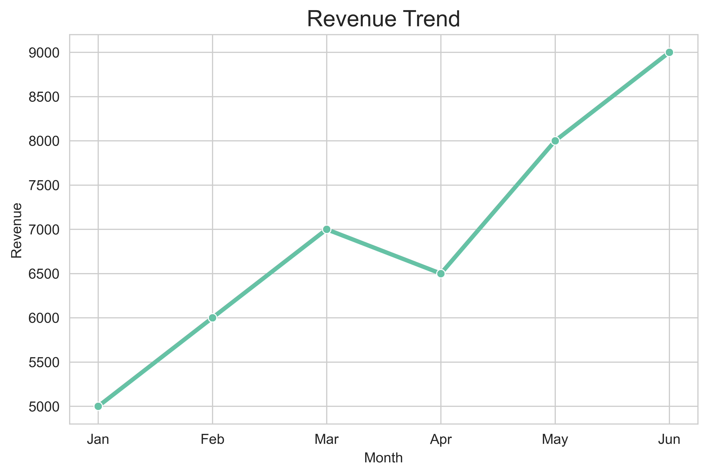
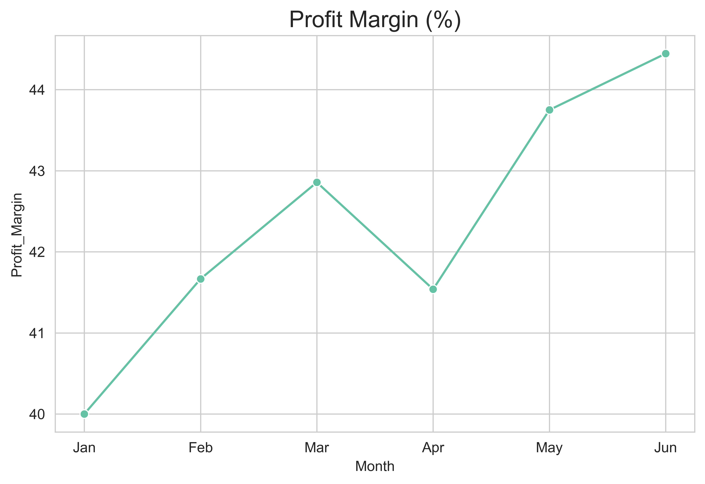
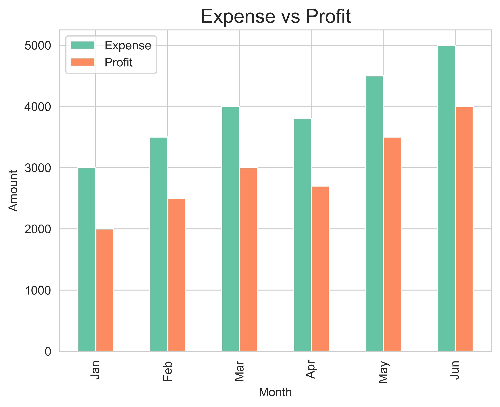
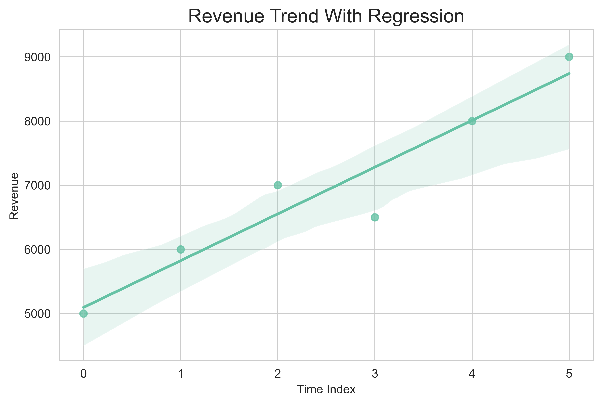

📊 Business Financial Dashboard

A Python-based financial dashboard that analyzes business performance using revenue, expense, and profit data.
This project provides clear insights through visualizations and trend analysis.

---

🚀 Features

- 📈 Revenue trend analysis (monthly)
- 💸 Expense vs Profit comparison (bar chart)
- 📊 Profit margin calculation (%)
- 📉 Regression analysis for revenue trends
- 🧾 Key financial metrics (Total Revenue, Expense, Profit)

---

🛠️ Tech Stack

- Python
- Pandas
- Matplotlib
- Seaborn

---

📂 Project Structure

business-financial-dashboard/
│
├── finance.csv
├── main.py
├── revenue_trend.png
├── expense_profit.png
├── profit_margin.png
├── regression.png
└── README.md

---

▶️ How to Run

1. Install required libraries:

pip install pandas matplotlib seaborn

2. Run the script:

python main.py

---

📊 Output

The project generates the following visualizations:

- Revenue Trend
- Expense vs Profit
- Profit Margin
- Regression Analysis

---

🎯 Use Case

This dashboard helps businesses:

- Track financial performance
- Understand profit trends
- Make data-driven decisions

---

📌 Author

Vikram Prajapati
GitHub: https://github.com/vikramcodex0

---
## 📊 Dashboard Preview

